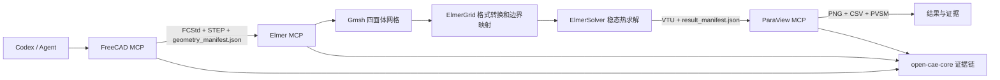

# OpenCAE MCP 三软件协同仿真冒烟测试总结报告

> 本文是 2026-08-09 的初始稳态热传导验证记录。当前电磁扩展、49 工具覆盖和最新回归结果见
> [二维谐波变压器验证报告](transformer-induction-validation-report.zh-CN.md)。

- 报告日期：2026-08-09
- 最终验收项目：`codex_mcp_heat_smoke_v2`
- 最终结论：**PASS**
- 软件链：FreeCAD → Gmsh / Elmer FEM → ParaView
- 调用方式：Codex 用户级配置中的三个独立 STDIO MCP Server

## 1. 本次完成了什么

本次工作完成了一个可在 Codex 中注册和调用的 OpenCAE Agent Stack。它不是把三个软件简单地启动起来，而是为 FreeCAD、Elmer FEM 和 ParaView 分别实现独立 MCP Server，并用统一的工作区、结构化清单和证据记录把它们连接为可审计的 CAE 流程。

已完成的主要能力如下：

1. `freecad-mcp`：暴露 15 个工具，用于环境探测、文档、参数化特征、布尔、变换、检查、验证和 STEP 导出。
2. `elmer-mcp`：暴露 16 个工具，用于案例、几何导入、Gmsh 网格、ElmerGrid 转换、材料、方程、边界条件、SIF、求解和结果检查。
3. `paraview-mcp`：暴露 17 个工具，用于持久化 `pvpython` 会话、数据集、过滤器、着色、相机、图片、CSV 和 PVSM 状态导出。
4. `open-cae-core`：提供受限工作区、进程白名单、统一响应、作业状态、日志、哈希和证据链。
5. 三个 MCP 可注册到用户级 `~/.codex/config.toml`，并且不会覆盖无关 MCP 配置。
6. 建立了真实 MCP 协议编排脚本 `scripts/mcp_heat_smoke.py`，它读取 Codex 中实际注册的命令和环境，不绕过 MCP 直接调用业务服务。

## 2. 案例研究说明

### 2.1 案例目标

研究一个尺寸为 `10 mm × 10 mm × 10 mm` 的立方体稳态热传导问题：

- 材料导热系数：`1 W/(m·K)`
- `x = 0 mm` 面：固定温度 `300 K`
- `x = 10 mm` 面：固定温度 `400 K`
- 其余四个面：自然零热流
- 目标结果：温度应沿 x 方向近似线性变化，中心温度理论值约为 `350 K`

该案例几何简单，但能同时验证 CAD 建模、格式传递、网格、语义边界映射、有限元求解、结果字段读取和可视化，是合适的全链路冒烟测试。

### 2.2 理论基准

对于常导热系数、无内热源的一维稳态热传导，解析解为：

`T(x) = 300 + 10 × x_mm K`

因此：

- 理论最小温度：`300 K`
- 理论最大温度：`400 K`
- 理论中心温度：`350 K`

## 3. 三个软件之前的配合操作逻辑

### 3.1 FreeCAD 阶段：6 次调用，6 次成功

1. `freecad_environment_probe`
2. `freecad_document_create`
3. `freecad_feature_create`：创建 `Cube` 参数化盒体
4. `freecad_document_inspect`
5. `freecad_geometry_validate`
6. `freecad_export_step`

FreeCAD 输出：

- `geometry/model.FCStd`
- `geometry/model.step`
- `geometry/geometry_manifest.json`

几何清单不是附属文件，而是软件间的语义合同。它记录 `semantic_id = cube`、单位、包围盒、质心和体积，供 Elmer 阶段确认接收到的实体含义。

### 3.2 Elmer 阶段：14 次调用，14 次成功

1. 环境探测和案例创建
2. 接收 STEP 与几何语义清单
3. Gmsh 生成四面体网格
4. ElmerGrid 转换网格格式
5. 根据坐标指纹把六个面映射为 `x_min/x_max/y_min/y_max/z_min/z_max`
6. 检查网格拓扑
7. 设置材料和稳态热方程
8. 分别设置 300 K 与 400 K 边界
9. 生成并验证 `case.sif`
10. 串行运行 ElmerSolver
11. 检查 VTU 的字段、有限值和物理验收条件

Elmer 输出：

- `mesh/model.msh`
- `mesh/elmer_mesh/*`
- `mesh/semantic_map.json`
- `solver/case.sif`
- `results/case_t0001.vtu`
- `results/result_manifest.json`

### 3.3 ParaView 阶段：16 次调用，16 次成功

1. 探测 ParaView 环境并启动 MCP 独占的持久化 `pvpython` worker
2. 打开并检查 VTU
3. 自动识别实际温度数组 `temperature`
4. 按温度着色、调整相机并输出表面云图
5. 创建中面 Slice、重新定向相机并输出切片图
6. 输出完整温度 CSV
7. 保存 ParaView 状态文件 PVSM
8. 检查管线并正常停止 worker

ParaView 输出：

- `post/mcp_temperature_surface.png`
- `post/mcp_temperature_slice.png`
- `post/mcp_temperature.csv`
- `post/mcp_pipeline.pvsm`

## 4. 最终结果

### 4.1 几何正确性

| 项目 | 结果 | 理论值 | 结论 |
|---|---:|---:|---|
| 包围盒 | `[0,10] × [0,10] × [0,10] mm` | 相同 | 通过 |
| 质心 | `(5,5,5) mm` | 相同 | 通过 |
| 体积 | `999.9999999999998 mm³` | `1000 mm³` | 通过 |
| 有效实体 | 1 个 | 1 个 | 通过 |

### 4.2 网格结果

| 项目 | 数值 |
|---|---:|
| 节点 | 235 |
| 体单元 | 734 |
| 边界单元 | 396 |
| 六个几何面 | 每面 66 个边界单元 |
| VTU 总单元 | 1130（734 体单元 + 396 边界单元） |

语义边界映射结果为：`x_min → 1`、`x_max → 2`、`y_min → 3`、`y_max → 4`、`z_min → 5`、`z_max → 6`。

当前网格验收检查了拓扑、数量、坐标范围和语义边界，但尚未实现独立 Jacobian/长宽比质量门控；Gmsh 日志仍是质量信息来源。

### 4.3 热传导结果

| 指标 | 计算值 | 目标/容差 | 结论 |
|---|---:|---:|---|
| Tmin | `299.99999999999994 K` | `300 ± 1 K` | 通过 |
| Tmax | `400.00000000000006 K` | `400 ± 1 K` | 通过 |
| Tmid | `350.26994261005336 K` | `350 ± 3 K` | 通过 |
| 字段有限性 | 全部有限 | 不允许 NaN/Inf | 通过 |

中心温度绝对误差约为 `0.26994 K`，相对理论中心温度约为 `0.0771%`。最小、最大温度误差处于浮点舍入量级。

表面云图正确显示 300 K 到 400 K 的主梯度。中面切片位于 `x = 5 mm`，理论上应接近常温 350 K；其色标对极小数值波动自动缩放，因此切片颜色变化不能解释为 100 K 的温差，主物理判断应以字段数值和表面图为准。

## 5. 操作通过率、覆盖率与“正确率”口径

### 5.1 最终验收运行

| 检查层 | 通过/总数 | 通过率 | 说明 |
|---|---:|---:|---|
| FreeCAD MCP 调用 | 6/6 | 100% | 最终编排 |
| Elmer MCP 调用 | 14/14 | 100% | 最终编排 |
| ParaView MCP 调用 | 16/16 | 100% | 最终编排 |
| MCP 调用合计 | 36/36 | 100% | 失败调用 0 |
| 共享证据中的业务工具调用 | 29/29 | 100% | 全部 `SUCCEEDED` |
| 原生批处理命令 | 8/8 | 100% | FreeCADCmd、Gmsh、ElmerGrid、ElmerSolver 均退出码 0，未超时 |
| ParaView worker 协议消息 | 15/15 | 100% | 包括启动探测、处理和正常停止 |
| 物理验收指标 | 3/3 | 100% | Tmin、Tmax、Tmid |
| 哈希记录 | 19/19 | 100% | 已记录产物均有 SHA-256 与尺寸 |
| 自动化测试（实际执行） | 8/8 | 100% | 另有 1 个原生测试为显式 opt-in 跳过 |
| 人工图像复核 | 2/2 | 100% | 表面图和修正后的切片图均可见 |

测试集中跳过的 1 项是 `tests/test_native_smoke.py`，其条件为 `OPEN_CAE_NATIVE_TESTS=1`。本次没有在常规 pytest 命令中打开该变量，但相同的真实 CAE 软件链已通过 MCP 编排独立执行并验收，因此不是用 mock 替代原生测试。

### 5.2 工具覆盖率

三个 Server 一共暴露 `15 + 16 + 17 = 48` 个工具。最终案例实际使用：

- 36 次工具调用
- 32 个不同工具
- 不同工具语义覆盖率：`32/48 = 66.7%`

因此就这一案例本身而言，应准确表述为：**案例所调用操作通过率为 100%，案例内不同工具覆盖率为 66.7%。**

在案例验收完成后，又执行了独立的发布工具矩阵：48/48 个暴露工具均至少调用一次，51/51 次契约调用通过。46 个可执行工具能力返回 `SUCCEEDED`；`freecad_capture_view` 和 `paraview_export_animation` 两个明确声明为 v0.1 不支持的能力按设计返回 `BLOCKED`。因此发布版本的声明工具契约覆盖率为 100%，但这仍不代表任意未来工程问题均已得到验证。

### 5.3 正确率结论

在本案例定义的验收范围内，几何、边界映射、有限值、三个温度指标、产物和可视化均通过，可称为“案例验收正确率 100%”。但该数字不能外推为一般 CAE 问题的普适数值精度。尚未完成的高阶正确性验证包括：

- 网格收敛性研究
- 全场解析解的 L2/L∞ 误差
- 独立求解器交叉验证
- 多材料界面和接触验证
- 瞬态时间步收敛
- MPI 与并行一致性

## 6. 软件协同状态评估

| 接口 | 当前状态 | 评价 |
|---|---|---|
| Codex → 三 MCP | 已注册并启用 | 正常 |
| FreeCAD → Elmer | STEP + JSON 语义清单 | 本案例稳定 |
| Gmsh → ElmerGrid | MSH2 + 坐标边界指纹 | 本案例稳定 |
| ElmerSolver → ParaView | VTU + result manifest | 稳定、字段可识别 |
| ParaView MCP 内部 | 持久化 pvpython worker | 15/15 消息成功并正常关闭 |
| 全链证据 | JSONL、日志、清单、SHA-256 | 可追溯 |

当前协同不是依赖 GUI 鼠标操作，而是通过受控进程、固定脚本和结构化数据传递，因此比 GUI 自动点击更可重复。三个软件之间最关键的耦合点是“语义清单”：它避免仅靠文件名猜测实体和边界含义。

## 7. 稳定性评价与调试历史

### 7.1 已证明的稳定性

- `heat_e2e_release`、`codex_mcp_heat_smoke` 和 `codex_mcp_heat_smoke_v2` 三次成功运行得到完全一致的 Tmin、Tmax 和 Tmid，数值重复性良好。
- 两次真实 MCP 完整数值编排分别完成 35 次和 36 次调用，均无工具失败。
- 最终小案例运行时间约 22 秒；前一次完整 MCP 运行约 29 秒。
- 原生进程均限定在白名单中，最终运行无超时、无残留 ParaView worker。

### 7.2 开发期间发现并修复的问题

1. **STDIO 子进程继承问题**：FreeCADCmd 从 MCP Server 继承标准输入后会等待 MCP 管道，造成超时。已在受控进程和版本探测中统一使用 `stdin = DEVNULL`。
2. **数值库线程导入问题**：Elmer 求解完成后，在 MCP 工具工作线程首次导入 `meshio/numpy` 可能阻塞。已改为 Server 启动主线程预加载。
3. **切片相机方向问题**：首个完整 MCP 运行在协议上 35/35 成功，但切片被沿边观看，人工检查发现图片主体不可见。已增加 `paraview_camera_set`，最终图像通过检查。

这些问题说明协议成功不等同于业务结果正确；最终验收同时保留了数值门控和人工图像检查。

### 7.3 尚不能声称的稳定性

当前可评为“单机、单案例、顺序调用稳定”，尚不能评为生产级长期稳定，原因包括：

- 没有执行 20/100 次连续 soak test
- 没有验证多个 Codex 任务并发写入不同项目
- 没有验证超大 STEP、百万级网格和长时间求解
- 没有系统执行故障注入、断电恢复和 worker 崩溃恢复
- ParaView 当前为 `6.2.0-RC1`，建议生产环境固定正式稳定版本
- MPI 可执行文件已探测到，但本次验收只使用串行 ElmerSolver

## 8. 其他案例实现可能性

### A 级：当前能力可直接或少量改动实现

- 盒体、圆柱、球、圆锥及简单布尔组合的稳态热传导
- 不同尺寸、导热系数、网格尺寸和固定温度的参数化案例
- 单一材料、简单连通实体的温度场分析
- 自动输出表面、切片、CSV、PVSM
- 通过外层编排循环实现小规模参数扫描

预估可行性：高。主要复用现有 `heat_steady_v1`、语义边界和后处理链。

### B 级：需要扩展 Elmer 案例模型和验收规则

- 对流换热、热流密度、内热源
- 多材料稳态导热与界面连续性
- 瞬态热传导
- 网格收敛和多工况批处理
- 自动生成工程报告和对比图

预估可行性：中高。架构无需重写，但要增加边界/材料 schema、SIF 模板、时间步和新的物理验收器。

### C 级：需要新增物理 Profile 和大量验证

- 线弹性、热应力、模态和屈曲
- 热-结构顺序耦合
- CFD、流固耦合、电磁或多物理场
- 非线性材料、大变形、接触
- 复杂装配体的接触和网格策略

预估可行性：中等或较低，取决于物理复杂度。这些案例可沿用 MCP、工作区和证据架构，但不能只修改提示词，需要新增工具、求解模板、材料/载荷模型和基准算例。

## 9. 建议的下一阶段验收

1. 连续执行 20 次最终 MCP 案例，统计成功率、耗时均值、P95 和残留进程。
2. 使用 2 mm、1 mm、0.5 mm 网格做收敛研究，并加入全场解析误差。
3. 将图像“非空主体面积”和可见代理数量加入自动验收，自动捕获空白渲染。
4. 在专门的原生测试任务中启用 `OPEN_CAE_NATIVE_TESTS=1`。
5. 增加对流/热流/内热源，形成第二组独立物理基准。
6. 增加并发项目测试、超时取消、worker 崩溃重启和孤儿进程清理测试。
7. 将 ParaView 从 RC 版固定到正式稳定版后重新建立基准。

## 10. 最终判断

该项目已经证明：Codex 可以通过三个独立 MCP Server 完成真实的 FreeCAD 建模、Elmer 有限元求解和 ParaView 后处理，并形成可复查的中间文件、日志、清单和最终结果。

对于本次 10 mm 立方体稳态热传导案例，最终 36 次 MCP 调用全部通过，几何和三个物理指标均满足验收条件，三软件顺序协同状态正常。当前成熟度适合作为 **OpenCAE 自动化原型和扩展基线**；在完成多次稳定性、网格收敛、并发、故障恢复和更多物理基准之前，不应直接宣称为通用生产级 CAE 平台。

## 11. 证据位置

- MCP 完整调用轨迹：`workspace/codex_mcp_heat_smoke_v2/evidence/mcp_orchestration.json`
- 原生命令记录：`workspace/codex_mcp_heat_smoke_v2/evidence/commands.jsonl`
- 服务工具记录：`workspace/codex_mcp_heat_smoke_v2/evidence/tool_calls.jsonl`
- ParaView worker 记录：`workspace/codex_mcp_heat_smoke_v2/evidence/worker_protocol.jsonl`
- 产物哈希：`workspace/codex_mcp_heat_smoke_v2/evidence/hashes.json`
- 几何清单：`workspace/codex_mcp_heat_smoke_v2/geometry/geometry_manifest.json`
- 网格清单：`workspace/codex_mcp_heat_smoke_v2/mesh/mesh_manifest.json`
- 结果清单：`workspace/codex_mcp_heat_smoke_v2/results/result_manifest.json`
- 表面温度图：`workspace/codex_mcp_heat_smoke_v2/post/mcp_temperature_surface.png`
- 中面切片图：`workspace/codex_mcp_heat_smoke_v2/post/mcp_temperature_slice.png`
