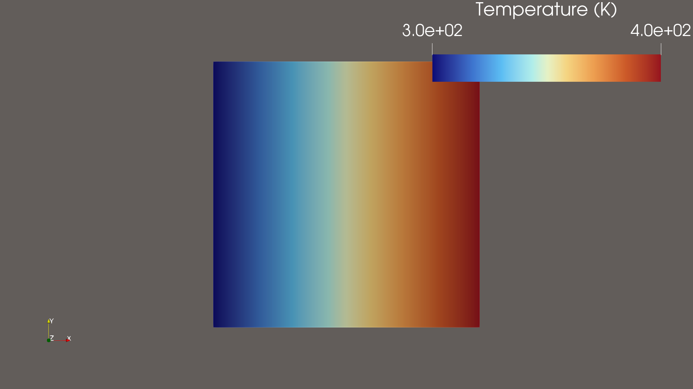

# 10 mm Cube Steady Heat Conduction

This curated example is the release benchmark for the FreeCAD → Elmer FEM → ParaView chain.

- Geometry: 10 mm cube
- Conductivity: 1 W/(m·K)
- x-min boundary: 300 K
- x-max boundary: 400 K
- Expected midpoint: 350 K

Validated result:

- Tmin: 299.99999999999994 K
- Tmax: 400.00000000000006 K
- Tmid: 350.26994261005336 K
- Mesh: 235 nodes, 734 volume elements, 396 boundary elements

The directory contains only small, public-safe manifests and a curated image. Native FCStd, STEP, mesh, VTU, logs, and local paths remain outside version control.

